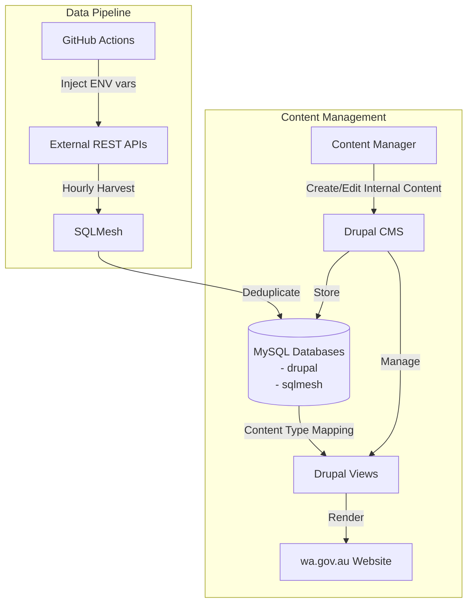

# SQLMesh Data Pipeline for Drupal Integration
## Overview
This document outlines an hourly process using SQLMesh to harvest data from external REST APIs, transform it, and store it in MySQL for consumption by Drupal views on wa.gov.au. Content ownership is determined by environment variables injected via GitHub Actions self-hosted runners, running near the database instance.

[](https://codespaces.new/wagov-dtt/wa.gov.au_harvest-consultations)

Once opened, you can run `sqlmesh ui` in the cli, and open the resultant port in a browser to edit/debug the pipelines.

## Developing with Skaffold

The `justfile` in this repository has most useful commands:

```bash
$ just -l
Available recipes:
    build    # Build container images
    everest  # Percona Everest webui to manage databases
    minikube # Setup minikube
    prereqs  # Install project tools
```

To get started, run `just everest` and use the web ui to create a database.

The database will need to have `pxc_strict_mode=PERMISSIVE` set as a parameter to allow sqlmesh to create tables without primary keys.

Configure secrets then run `skaffold dev` (which expects secrets created in cluster).

## Deploying to AWS

TODO: Configure just command to push built image to AWS

## Workflow Diagram


## Content Types and Ownership

### Current Content Types
1. **Consultations**
2. **Service Locations**

### Content Ownership Model
- **External Authorship**
  - Source: REST API pipeline
  - Identification: GitHub Actions environment variables
  - Update frequency: Hourly via self-hosted runners
  - Drupal access: Read-only

- **Drupal Authorship**
  - Source: Drupal CMS
  - Identification: Standard Drupal authorship
  - Update frequency: Real-time
  - Drupal access: Full CRUD operations

## Process Steps

1. **Hourly Data Harvesting**: SQLMesh connects to and harvests data from external REST APIs
   - [SQLMesh Python Models](https://sqlmesh.readthedocs.io/en/stable/concepts/models/python_models/)
   - Configurable API endpoints and authentication
   - Runs every hour via scheduled task

2. **Data Transformation**: SQLMesh processes the harvested data
   - [SQLMesh SQL Models](https://sqlmesh.readthedocs.io/en/stable/concepts/models/sql_models/)
   - Data cleaning and standardization
   - Field mapping to Drupal content types
   - Authorship metadata tagging
   - Deduplication logic

3. **MySQL Integration**: 
   - Direct database loading from SQLMesh
   - Schema compatibility with Drupal requirements
   - Authorship tracking fields
   - Content versioning and updates

4. **Content Management**:
   - Read-only display of external content
   - Full management of Drupal-authored content
   - Content type mapping via Drupal Views
   - Integrated display on wa.gov.au website

## Key Components

### SQLMesh Pipeline
- **Python Models**: Define connections to REST APIs and MySQL output
- **SQL Transformations**: Create standardized data structures
- **Incremental Processing**: Handle hourly updates efficiently
- **Authorship Tagging**: Mark content as externally owned

### Drupal Integration
- **Content Types**: Structured data models for Consultations and Service Locations
- **Views**: Custom data presentations with ownership-aware access
- **Content Management**: User interface for Drupal-authored content

### MySQL Database
- Serves as primary storage for both external and internal content
- Maintains clear ownership designation
- Supports both hourly batch updates and real-time changes
- Enforces read-only access for external content

## Notes on Development
For detailed implementation guidance, refer to:
- [SQLMesh Documentation](https://sqlmesh.com/docs/)
- [Drupal Views Documentation](https://www.drupal.org/docs/user_guide/en/views-chapter.html)
