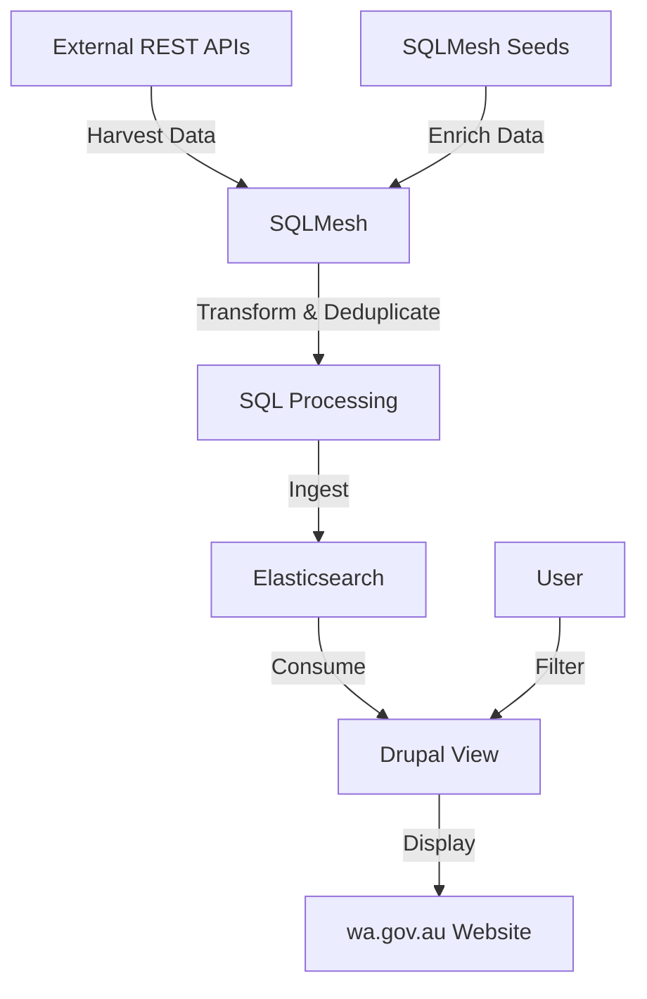

# SQLMesh Data Pipeline for Elasticsearch and Drupal Integration

## Overview

This document outlines a process using SQLMesh to harvest data from external REST APIs, enrich it using seeds, transform and deduplicate it, and store it in Elasticsearch for consumption by a Drupal view on wa.gov.au.

## Workflow Diagram

## Process Steps

1. **Data Harvesting**: Use SQLMesh to connect to and harvest data from external REST APIs.
   - [SQLMesh Data Sources Documentation](https://sqlmesh.com/docs/data-sources/)

2. **Data Enrichment with Seeds**: Utilize SQLMesh seeds to enhance the harvested data.
   - [SQLMesh Seeds Documentation](https://sqlmesh.com/docs/seeds/)

3. **Transformation and Deduplication**: Leverage SQLMesh's SQL capabilities to process the enriched data.
   - [SQLMesh SQL Functions and Operators](https://sqlmesh.com/docs/sql-functions-operators/)

4. **Elasticsearch Ingestion**: Configure SQLMesh to output the processed data to Elasticsearch.
   - [SQLMesh Sink Configuration](https://sqlmesh.com/docs/sinks/)

5. **Drupal Integration**: Set up a Drupal view to consume the Elasticsearch index directly, enabling filtering on wa.gov.au.

## Key SQLMesh Concepts

- **Sources**: Define connections to REST APIs
- **Seeds**: Provide static data for enrichment
- **Views**: Create SQL transformations
- **Sinks**: Configure output to Elasticsearch

## Notes on SQLMesh Seeds for Data Enrichment

SQLMesh seeds are a powerful feature for enriching source API data, resulting in a more comprehensive and useful Elasticsearch index. Here are some key points:

1. **Purpose**: Seeds allow you to incorporate static or slowly changing data into your data pipeline.

2. **Use Cases**:
   - Add metadata to API responses
   - Provide lookup tables for code-to-description mapping
   - Include default values for missing fields

3. **Implementation**: 
   - Define seeds as CSV files or SQL queries
   - Reference seeds in your SQLMesh views to join with API data

For detailed implementation guidance, refer to the [SQLMesh Documentation](https://sqlmesh.com/docs/).